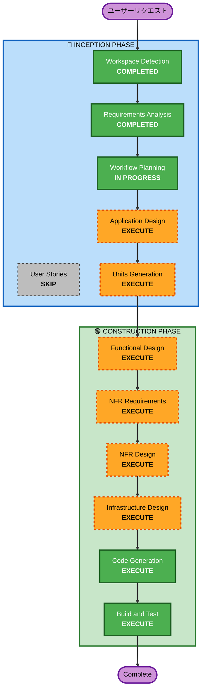

# 実行計画

## 詳細分析サマリー

### 変更影響評価
- **ユーザー向け変更**: はい — 新規Webアプリケーション全体
- **構造変更**: はい — フロントエンド + バックエンドAPI + データストア + 認証の新規構築
- **データモデル変更**: はい — コース情報、ユーザー、コレクション、閲覧履歴のスキーマ設計
- **API変更**: はい — 新規REST API設計
- **NFR影響**: はい — パフォーマンス（無限スクロール）、セキュリティ（認証）、スケーラビリティ（サーバーレス）

### リスク評価
- **リスクレベル**: 低〜中
- **理由**: グリーンフィールドで既存システムへの影響なし。技術スタックは成熟。MVPスコープは小規模。
- **ロールバック複雑度**: 低（新規構築のため）
- **テスト複雑度**: 中（フロントエンド + バックエンド統合テスト必要）

---

## ワークフロー可視化



### テキスト代替
```
Phase 1: INCEPTION
  - Workspace Detection (COMPLETED)
  - Requirements Analysis (COMPLETED)
  - User Stories (SKIP)
  - Workflow Planning (IN PROGRESS)
  - Application Design (EXECUTE)
  - Units Generation (EXECUTE)

Phase 2: CONSTRUCTION (per-unit)
  - Functional Design (EXECUTE)
  - NFR Requirements (EXECUTE)
  - NFR Design (EXECUTE)
  - Infrastructure Design (EXECUTE)
  - Code Generation (EXECUTE)
  - Build and Test (EXECUTE)
```

---

## 実行するフェーズ

### 🔵 INCEPTION PHASE
- [x] Workspace Detection (COMPLETED)
- [x] Requirements Analysis (COMPLETED)
- [ ] User Stories - **SKIP**
  - **理由**: MVPスコープが小規模で明確。単一ペルソナ（社会人全般）。ユーザーストーリーなしでも要件が十分に定義されている。
- [x] Workflow Planning (IN PROGRESS)
- [ ] Application Design - **EXECUTE**
  - **理由**: 新規コンポーネント（フロントエンド、API、データストア）の設計が必要。コンポーネント間の依存関係を明確化する必要あり。
- [ ] Units Generation - **EXECUTE**
  - **理由**: フロントエンド/バックエンド/インフラの3つのユニットに分解が必要。並行開発の計画に有用。

### 🟢 CONSTRUCTION PHASE (per-unit)
- [ ] Functional Design - **EXECUTE**
  - **理由**: コースフィードのランダム化ロジック、コレクション管理、発見マップの可視化ロジックなど、ビジネスロジックの詳細設計が必要。
- [ ] NFR Requirements - **EXECUTE**
  - **理由**: 無限スクロールのパフォーマンス要件、セキュリティ要件（Cognito統合）、サーバーレスアーキテクチャの設計が必要。
- [ ] NFR Design - **EXECUTE**
  - **理由**: NFR要件に基づくパターン設計（キャッシュ戦略、プリフェッチ、レート制限等）が必要。
- [ ] Infrastructure Design - **EXECUTE**
  - **理由**: AWS サービスマッピング（Lambda, DynamoDB, Cognito, CloudFront, S3, API Gateway）の詳細設計が必要。
- [ ] Code Generation - **EXECUTE** (ALWAYS)
  - **理由**: 実装コード生成。
- [ ] Build and Test - **EXECUTE** (ALWAYS)
  - **理由**: ビルド・テスト手順の生成。

---

## 見積もりタイムライン
- **合計ステージ数**: 10（完了2 + 実行8）
- **スキップ**: 1（User Stories）
- **見積もり期間**: 1〜2週間（MVP開発）

## 成功基準
- **主目標**: TikTok風無限スクロールでトレノケートのコースを没入的にブラウズできるWebアプリの完成
- **主要成果物**:
  - React/Next.js フロントエンド（S3 + CloudFront）
  - Python Lambda バックエンドAPI
  - DynamoDB データストア
  - Cognito 認証
  - コレクション＆発見ログ機能
- **品質ゲート**:
  - フィード初回表示 2秒以内
  - セキュリティ拡張ルール全項目準拠
  - PBT拡張ルール全項目準拠
  - レスポンシブデザイン（モバイルファースト）
